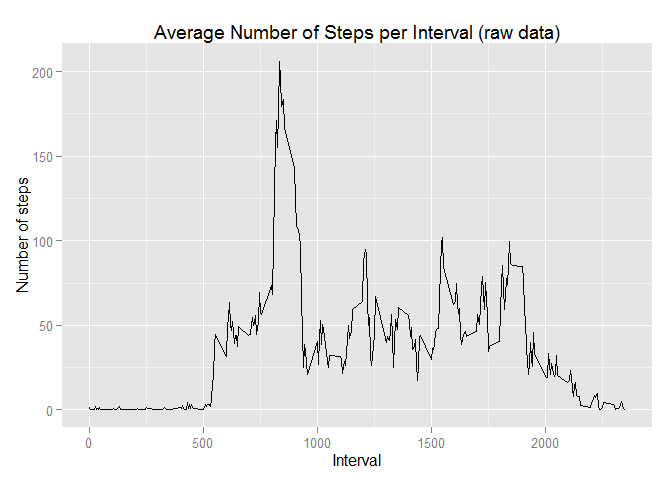

# Reproducible Research: Peer Assessment 1


## Loading and preprocessing the data

```r
setwd("C:/Users/DE-77691/Documents/1_Work/Tasks/Coursera/Lec5/W2/")
data_raw <- read.csv('activity.csv', colClasses = c("integer","Date", "factor"))
data_nona <- na.omit(data_raw)
```


## What is mean total number of steps taken per day?
Plot steps per day

```r
suppressWarnings(library(ggplot2))
m <- ggplot(data_nona, aes(date, steps)) 
m <- m + labs(title = "Steps per Day", y= 'Number of steps', x ='Date') + geom_bar(stat= 'identity')
m
```

 

```r
##Calculate mean and median steps per day

totalsteps <- aggregate(data_nona$steps, by = list(data_nona$date), FUN=sum, simplify=TRUE)
mean_v1 <- mean(totalsteps$x)
median_v1 <- median(totalsteps$x)
```


## What is the average daily activity pattern?
Plot average steps per interval 

```r
steps_interval <- aggregate(
                          data_nona$steps
                            , by = list(as.numeric(as.character(data_nona$interval)))
                            , FUN=mean
                            , simplify =TRUE 
                          )
n <- ggplot(steps_interval, aes(y=x, x=Group.1)) + geom_line ()
n
```

 
Maximum number of steps

```r
steps_interval[steps_interval$x == max(steps_interval$x), ]
```

```
##     Group.1        x
## 104     835 206.1698
```

## Imputing missing values
Get number of NAs

```r
sum(is.na(data_raw))
```

```
## [1] 2304
```

Strategy to deal with NAs --> enter step average of that interval

```r
data_clean <- data_raw

for(i in 1:nrow(data_clean)) {
  if(is.na(data_clean$steps[i])){
    interval <- data_clean[i, 3]
    date_avg <- steps_interval[steps_interval$Group.1 == interval,2]
    data_clean$steps[i] <- date_avg
  }
}
o <- ggplot(data_clean, aes(date, steps)) 
o <- m + labs(title = "Steps per Day", y= 'Number of steps', x ='Date') + geom_bar(stat= 'identity')
o
```

 

```r
totalsteps_clean <- aggregate(data_clean$steps, by = list(data_clean$date), FUN=sum, simplify=TRUE)
mean_v2<-mean(totalsteps_clean$x)
median_v2 <-median(totalsteps_clean$x)
mean_v1 - mean_v2
```

```
## [1] 0
```

```r
median_v1 - median_v2
```

```
## [1] -1.188679
```

## Are there differences in activity patterns between weekdays and weekends?

```r
## create factor variable for weekdays and weekend days
data_clean$day_type <- factor(weekdays(data_clean$date))
levels(data_clean$day_type) <- list(weekday = c("Monta
                                                g", "Dientag",
                                             "Mittwoch", 
                                             "Donnerstag", "Freitag"),
                                 weekend = c("Samstag", "Sonntag"))


average_steps_clean <- aggregate (data_clean$steps
                                  , by = list(as.numeric(as.character(data_clean$interval)), data_clean$day_type)
                                  , FUN=mean)

p <- ggplot(average_steps_clean , aes(y=x, x=Group.1 )) + geom_line() + facet_grid(Group.2 ~ .)
p <- p +  labs(title = "Comparison of Steps per Interval for weekday/weekends", y= 'Number of steps', x ='Interval') 
p
```

 


